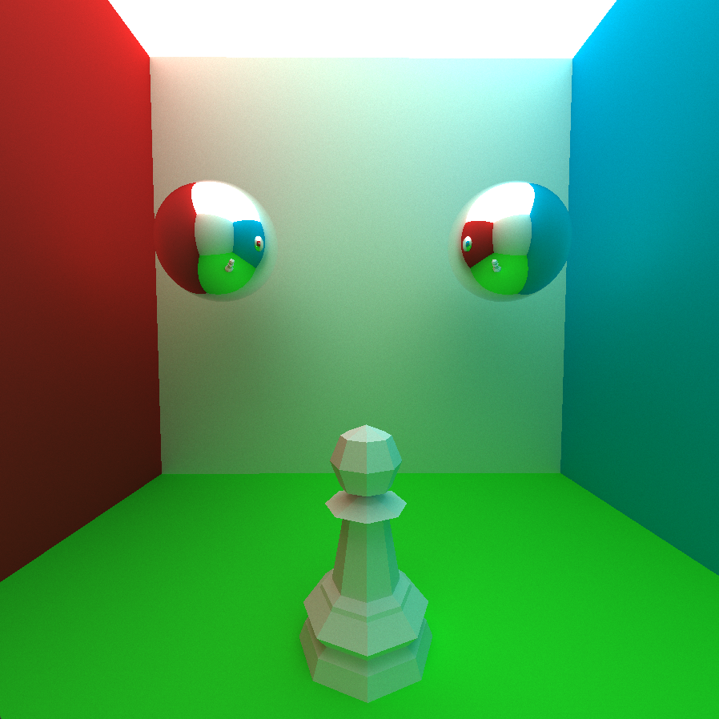
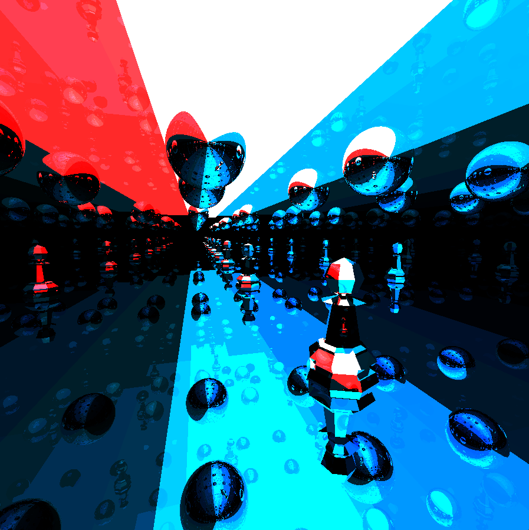
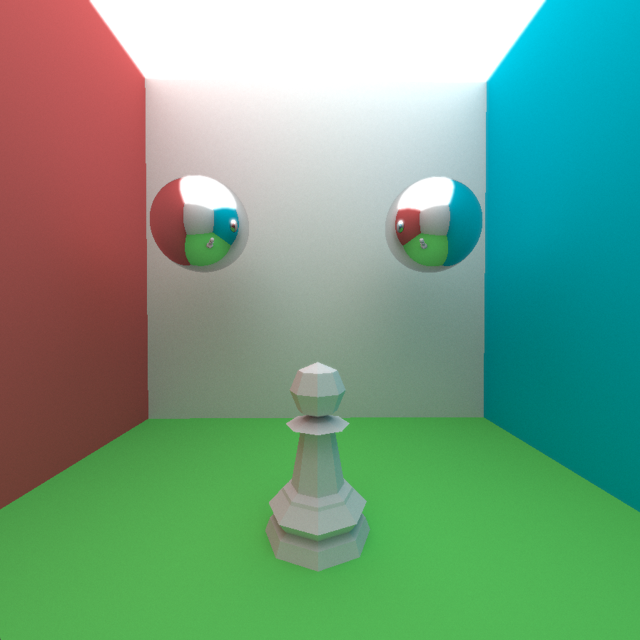

# Real Time Ray/Path Tracer

## Overview
This Path Tracer is a C++ project built with OpenGL for visualization. It allows for real-time rendering of 
scenes containing basic shapes like Triangles, Spheres, and Planes as well as basic low-poly models that the 
user can specify.



## Features
- **Real Time Rendering** All rendering and scene modifications are done in real time.
- **Basic Shapes** Supports basic shapes like triangles, spheres, and planes.
- **Basic Materials and lighting** Supports rough and smooth materials alongside diffuse and specular lighting.
- **3D Camera movement** User is able to manuever about the scene with a basic fly style camera.
- **Scene Editing UI** Straightforward scene editing with dynamic ImGui UI.




## Bloom Shading and gamma correction


## Requirements
### Software
- C++ compiler (supporting C++17 or later)
- OpenGL (4.0 or later)
- GLFW library (included)
- GLAD library (included)
- Assimp (included)

### Hardware
- As strong a computer as you can manage

## Installation
1. **Clone the Repository**
   ```bash
   git clone git@github.com:KyNgo2002/RayTracer.git
   cd Raytracer
   ```

2. **Install Dependencies**
   - Ensure that all required third party libraries are installed on your system.


## Usage
- **Movement** WASD, SHIFT, SPACE, and MOUSE for camera movement
- **Scene Editor** Press `E` to open/close the scene editor
- **Exit Program:** Press `Esc` to reset the Program.


## Acknowledgments
- AI was used in the creation of this ReadMe, as well as for research purposes.
- OpenGL for rendering support.
- GLFW and GLAD for simplifying OpenGL integration.
- Assimp for model loading in OpenGl.

## Contact
My LinkedIn: https://www.linkedin.com/in/ky-ngo/

My Github: https://github.com/KyNgo2002

My Portfolio: https://kyngo2002.github.io/portfolio/

For questions or support, please contact [Kyngo992@gmail.com].


